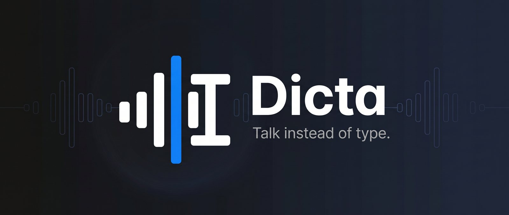
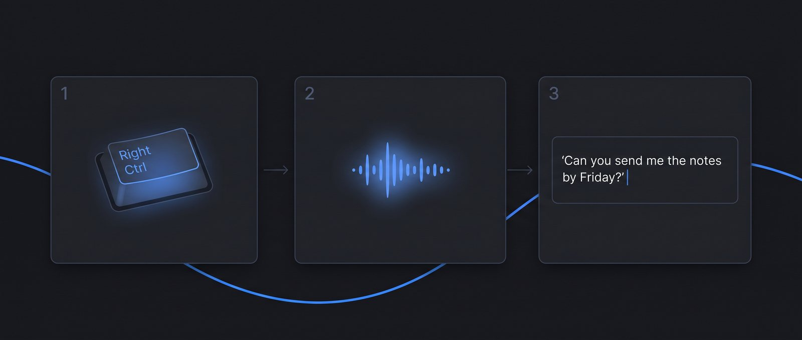
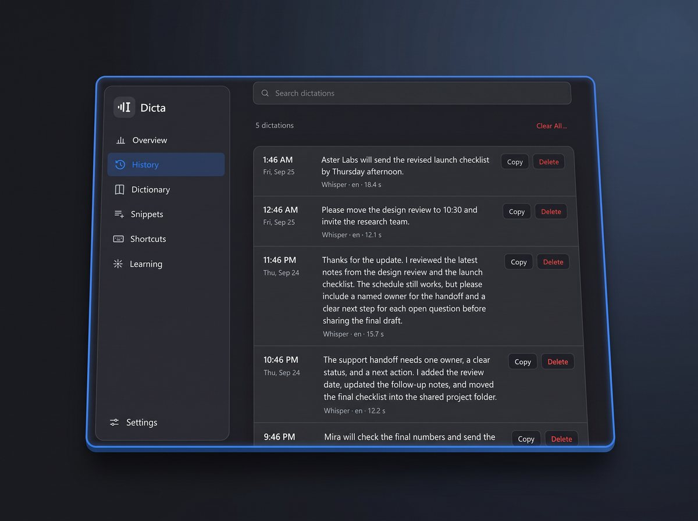
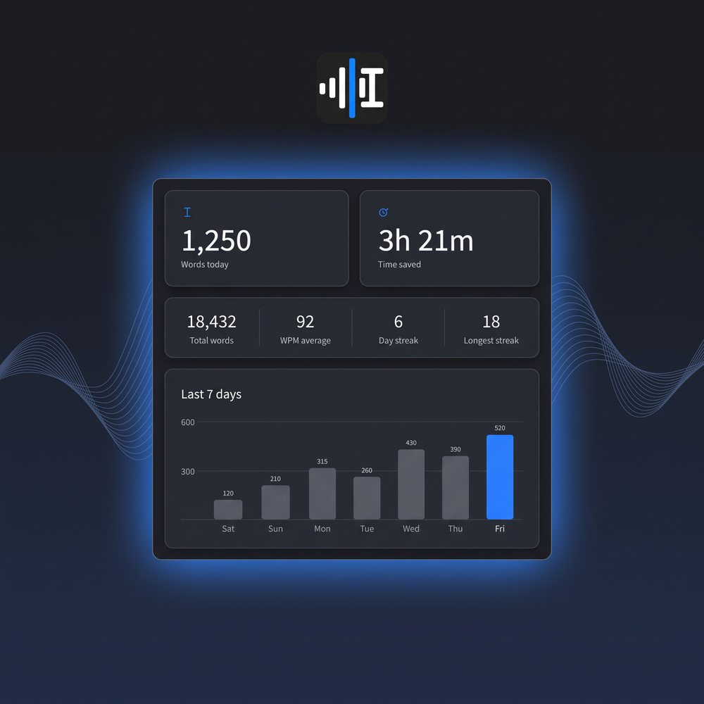

**Hold a key, talk, and your words appear wherever you're typing.**

&nbsp;

Windows 10/11 (64-bit) &nbsp;·&nbsp; macOS 26 (Tahoe) or newer &nbsp;·&nbsp; <a href="https://github.com/leocreated/dicta-releases/releases">All releases</a>

 

## What it does

- **Talk instead of type.** Hold a key, speak, let go. The text is typed at your cursor.
- **Works in any app.** Email, documents, chat, your browser, your code editor.
- **Speech recognition on your own computer.** No account needed.
- **Optional Rewrite.** Turn rambling speech into clean text with your own Groq key.
- **Learns your words.** Teach Dicta names and spellings, and add replacement rules.
- **History.** Search, copy or delete everything you've dictated.

  

## Getting started

### Windows

1. Download and run the installer above.
2. **Hold Right Ctrl**, speak, then release. Your words are typed where your cursor is.
3. **Double-tap Right Ctrl** for hands-free dictation. Tap once more to stop.

### Mac

1. Open **Dicta.dmg** and drag **Dicta** onto the **Applications** shortcut.
2. First launch only: right-click **Dicta** in Applications, choose **Open**, then **Open** again. macOS asks once because the app isn't from the App Store.
3. Allow **Accessibility**, **Input Monitoring** and the **microphone** when asked (System Settings, Privacy & Security).
4. **Hold Fn (Globe)**, speak, then release. **Double-tap Fn** for hands-free.

## System requirements

| | |
|---|---|
| **Windows** | Windows 10 or 11, 64-bit. An NVIDIA graphics card is optional and makes transcription faster; without one, Dicta runs on the CPU. |
| **Mac** | macOS 26 (Tahoe) or newer. Apple Silicon recommended. |

## Updates

Dicta updates itself. There is nothing to reinstall.

## Privacy

Speech recognition runs on your computer. Rewrite sends text to Groq only if you turn it on with your own key.

  

